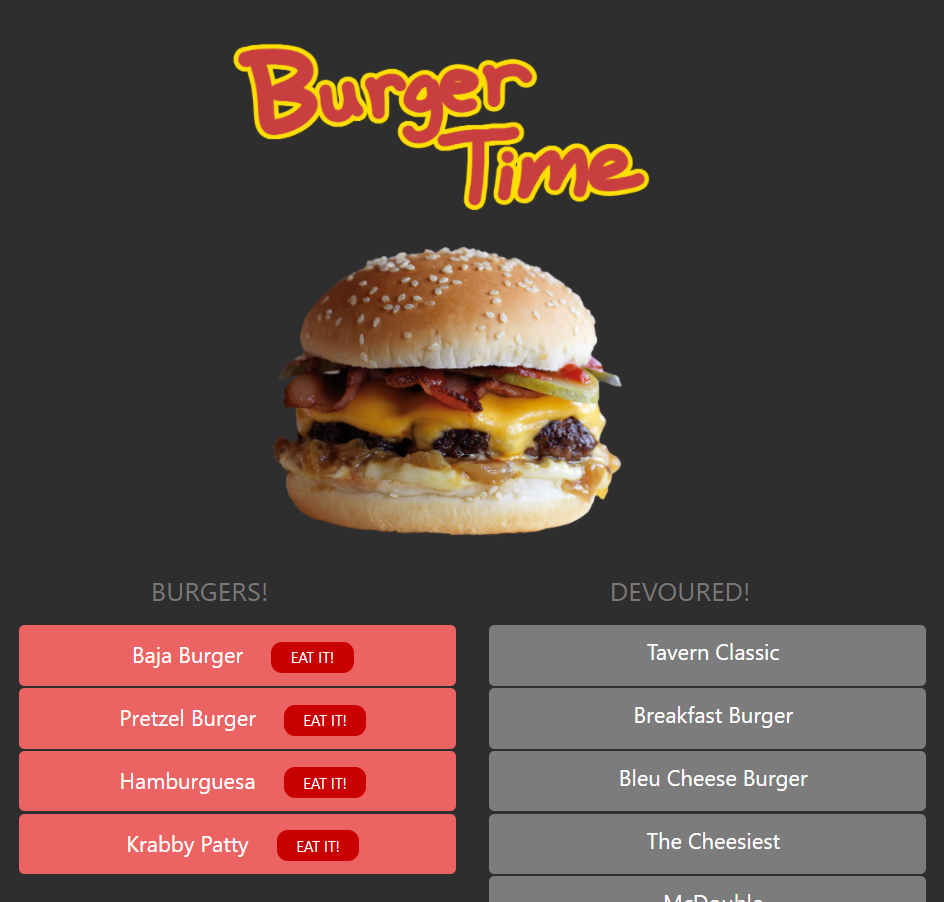

# Burger Time!

Ridiculous just-for-fun assignment for the UCONN Coding Bootcamp. The goal was to create and use a custom ORM to manage a silly database of burger info - just names and a boolean "devoured" status. 

## Table of Contents

- [Installation](#installation)
- [Usage](#usage)
- [Contributing](#contributing)

## Installation

"npm install" all dependencies, spin up a MySQL server, and go to town.

## Usage

Check out the live Heroku deployment at (link here)

## Contributing

If you would like to contribute to the project, please contact the developer and ask for access to the repository at github.com/njohnerwin

